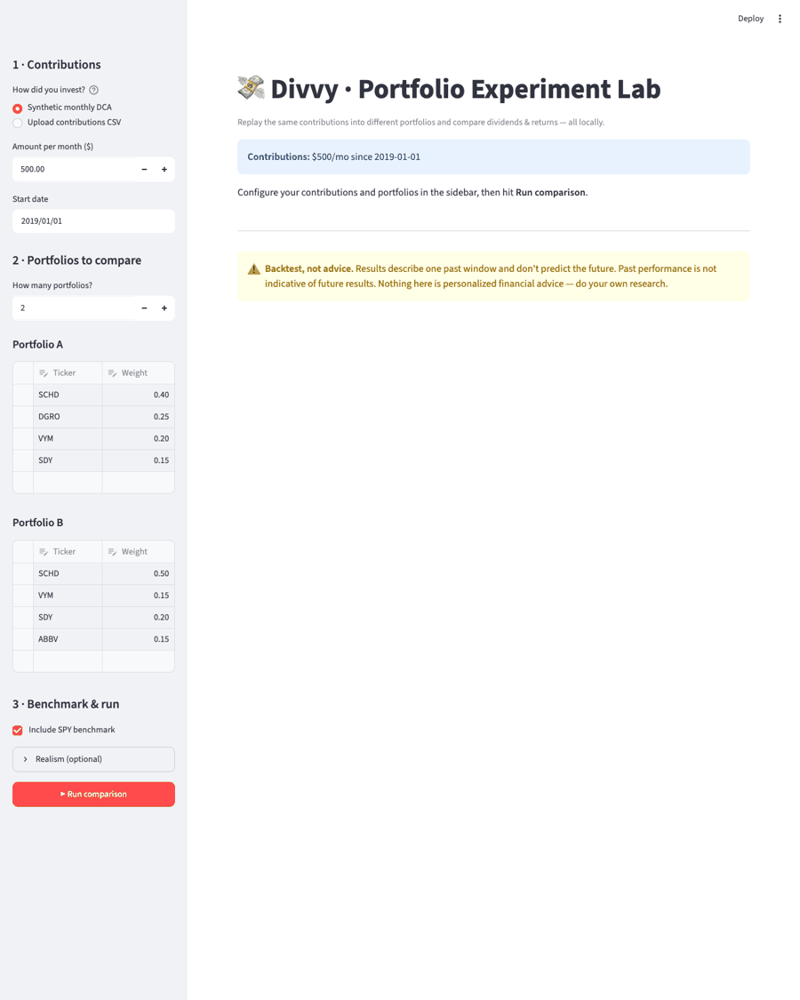

<div align="center">

# 💸 Divvy

### *"What if I'd invested my money into **that** portfolio instead?"*

**Replay your real investing history against a different set of holdings — and see the dividends and returns you *would* have earned.**

[](https://github.com/DanMat/Divvy/actions/workflows/ci.yml)
[](LICENSE)
[](https://www.python.org/)
[](https://github.com/astral-sh/uv)

<br>



<sub><i>The interactive Experiment Lab: add portfolios, tweak the knobs, and compare dividends & returns live. (<code>divvy ui</code>)</i></sub>

</div>

---

Every backtester on the internet (Portfolio Visualizer and friends) simulates a *make-believe* "$X every month." **Divvy is different: it replays the exact money you actually invested** — the real dates, the real dollar amounts, straight from your broker — into whatever portfolio you're curious about. So instead of a hypothetical, you get *your* answer:

> 💡 *"If I'd put the exact money I actually invested into **this** basket of ETFs/stocks instead, how much more — in dividends specifically, and in total — would I have made?"*

Dividends get reinvested (DRIP) into the same holding, so it compounds exactly like a real brokerage account.

### Why it exists

No off-the-shelf tool does this. They all assume a clean, synthetic contribution schedule. Real investing is lumpy — you skip months, you add lump sums, you rebalance. Divvy replays your **actual** cash-flow history against a counterfactual portfolio, and reports on **dividend income** as a first-class metric (not just total return) — the thing dividend investors actually care about.

### ✨ Features

- 🔁 **Real-ledger replay** — your actual contribution calendar, not a synthetic assumption
- 🧺 **Compare any number of "buckets"** (portfolios) side by side from simple YAML
- 💵 **Dividends as a first-class metric** — lifetime *and* trailing-12-month run-rate
- 📈 **DRIP compounding**, money-weighted return (XIRR), equity & dividend charts
- 🧪 **Interactive Experiment Lab** — a local web app to tweak weights with sliders and compare live
- 🚀 **Zero-data quickstart** — try it in 10 seconds with synthetic mode
- 🔌 **Bring your own data** — generic CSV, or a Fidelity ledger / 1099 importer
- 🔒 **Private by default** — your financial data never leaves your machine

---

## Install

```bash
pip install divvy-backtest          # core CLI (import + command are 'divvy')
pip install 'divvy-backtest[ui]'    # + interactive Experiment Lab
```

Or run from source with [uv](https://github.com/astral-sh/uv): `uv sync`.

## ⚡ Quickstart (no data required)

Backtest a hypothetical "$500/month since 2019" into a couple of dividend baskets:

```bash
uv sync
uv run divvy compare \
  --synthetic-monthly 500 --synthetic-start 2019-01-01 \
  --bucket examples/buckets/dividend_etf_core.yaml \
  --bucket examples/buckets/high_yield_tilt.yaml
```

…and out comes a side-by-side comparison, plus equity & dividend charts in `results/<date>/`:

```text
          variant  total_contributed  total_dividends  trailing_12mo_dividends  ending_value  total_return_pct  xirr_pct
dividend_etf_core             7200.0           764.12                   294.02      11641.27             61.68     12.47
  high_yield_tilt             7200.0           958.87                   336.69      11277.28             56.63     11.61
```

*(illustrative output from the bundled example data)*

---

## 🧪 Interactive Experiment Lab

Prefer sliders to flags? Launch the local web app and tweak portfolios live — add/remove tickers, drag weights, and watch the comparison table and charts update:

```bash
pip install 'divvy-backtest[ui]'   # or: uv sync --extra ui
uv run divvy ui
```

It opens in your browser (running 100% locally — no data leaves your machine): pick a contribution source, edit one or more portfolios in the sidebar, hit **Run comparison**, and get headline metrics, a sortable table, and interactive value & dividend charts.

---

## Bring your own contributions

Any broker can give you a list of what you invested and when. Put it in a two-column CSV:

```csv
date,amount
2021-01-04,200
2021-02-01,200
```

```bash
uv run divvy compare \
  --contributions-csv my_contributions.csv \
  --bucket examples/buckets/dividend_etf_core.yaml
```

See [`examples/contributions.csv`](examples/contributions.csv) for a full sample.

## Define a "bucket" (a candidate portfolio)

A bucket is just a YAML file of tickers and target weights (must sum to 1.0):

```yaml
name: My dividend basket
weights:
  SCHD: 0.50
  VYM: 0.15
  SDY: 0.20
  ABBV: 0.15
```

Drop new buckets in your own `buckets/` folder (gitignored) and pass as many `--bucket` flags as you like to compare them side by side.

## Compare against your *actual* Fidelity account

If you export your Fidelity transaction history CSVs, Divvy can auto-derive both your real contribution calendar **and** the real dividends you received, and add your actual account as a comparison row:

```bash
uv run divvy compare \
  --ledger path/to/fidelity_history_csvs/ \
  --bucket examples/buckets/dividend_etf_core.yaml \
  --real-value 12345.67 --real-as-of 2026-07-03
```

### Import dividends from a Fidelity 1099 (optional)

To reconstruct the dividend income you actually received from a Consolidated 1099 PDF (as a comparison baseline):

```bash
pip install 'divvy-backtest[pdf]'
uv run divvy import-1099 --pdf 2025-Consolidated-1099.pdf --out dividends_2025.csv
```

> **Note:** a 1099 records dividends *received*, not what you *bought* — so it can't drive a backtest on its own (that needs your contribution calendar). It's a baseline helper. The parser targets Fidelity's 1099 layout; other brokers differ.

---

## What the numbers mean

| Column | Meaning |
| --- | --- |
| `total_contributed` | Sum of money you put in |
| `total_dividends` | Cumulative dividends received over the whole period (reinvested) |
| `trailing_12mo_dividends` | Dividend income in just the **last year** — your current annual income run-rate |
| `ending_value` | Portfolio value today |
| `total_return_pct` | `(ending_value − contributed) / contributed` |
| `xirr_pct` | Money-weighted annualized return (accounts for contribution timing) |
| `max_drawdown_pct` | Worst peak-to-trough drop of the basket (its own risk, independent of your cash-flow timing) |
| `annual_vol_pct` | Annualized volatility of the basket — lower is calmer |

Every comparison also includes an **SPY benchmark** row by default (disable with `--benchmark none`, or pick another ticker with `--benchmark VTI`), and a **dividend-income-by-year** chart so you can see income *growth*, not just a lifetime total.

### Realism knobs (optional)

Model a taxable account, periodic rebalancing, and fund fees:

```bash
uv run divvy compare --contributions-csv my.csv --bucket buckets/mine.yaml \
  --dividend-tax-rate 0.20 \   # reinvest only after-tax dividends; adds a net-income column
  --rebalance annual \         # annual | quarterly | monthly (default: none, DRIP drifts)
  --expense-ratio 0.0006       # annual fund fee applied to every holding (0.06%)
```

All three are also available in the Experiment Lab under **Realism (optional)**. Defaults leave behavior unchanged (tax-free DRIP, no rebalancing, no fees). The tax model is a flat-rate estimate — real dividend taxation (qualified vs. ordinary, brackets, state) is more nuanced.

## Project a future income goal

How much must you invest monthly to reach a target dividend income? `divvy project` gives both a deterministic estimate and a **Monte Carlo** range (returns are random, not a single guess):

```bash
uv run divvy project --income 2000 --current-value 7500 --monthly 1000 --years 25
```

Outputs the required contribution across return assumptions, plus p10/p50/p90 ending-value and after-tax-income scenarios. Like all projections, these are assumption-driven ranges, not predictions.

---

## ⚠️ This is a backtester, not a crystal ball

> [!WARNING]
> **Divvy is an analysis tool, not investment advice — and backtest results are not gospel.**
>
> - A backtest only tells you what **already happened** over one specific window. It says **nothing** about the future. A basket that crushed it over the last 3 years can easily lag over the next 3.
> - Past performance does **not** predict future results. Dividends can be cut, and any single stock can fall hard (the high-yield names that look best in a backtest often carry the most risk).
> - The projection helper (`divvy.project`) is built entirely on **assumptions you choose** (future return, yield, tax). Treat its output as a *range of scenarios*, not a promise.
> - Divvy does not know your taxes, fees, goals, or risk tolerance. **Nothing here is personalized financial advice.** Do your own research and, for real money decisions, talk to a licensed advisor.
>
> Use Divvy to *ask better questions* about your portfolio — not to get a "winner" to blindly follow.

---

## Data sources

- **Prices & dividend history:** [yfinance](https://github.com/ranaroussi/yfinance) (free, no key), cached to `data/cache/`.
- **Finviz Elite (optional):** if you have a key, copy `.env.example` to `.env` and add it — used only for ad-hoc yield/screening lookups, **not** required for the core backtest.

## 🔒 Privacy

Your financial data never leaves your machine and is never committed: `data/`, `results/`, your personal `buckets/`, and `.env` are all gitignored. Only code and the fake `examples/` data live in the repo.

## Install / dev

```bash
uv sync --extra dev   # or: pip install -e '.[dev]'
uv run pytest
```

See [CONTRIBUTING.md](CONTRIBUTING.md) — new broker adapters and 1099 importers are especially welcome.

## License

MIT — see [LICENSE](LICENSE).

<div align="center">

**Found this useful? Give it a ⭐ — it helps other dividend investors find it.**

</div>
